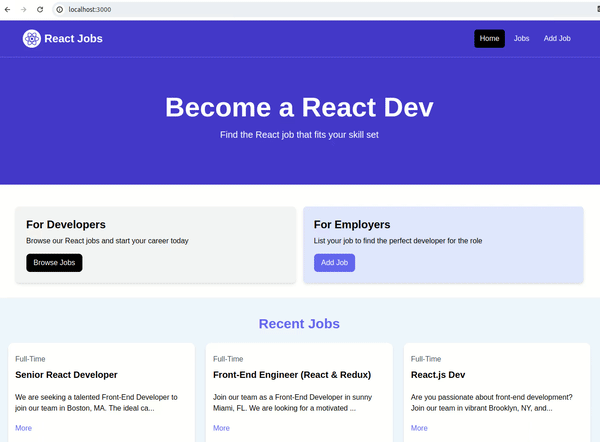

# Job Portal

### Project Description:

This project is a simple frontend application built with React, aimed at creating a job search web page. It leverages fundamental concepts of React such as components, props, state management, data fetching, and more.

The development journey unfolds as follows:
- **Understanding React Basics:** The tutorial covers the basics of React, including components, state, and hooks.
- **Setting Up the Project:** Vite is employed for a quick and efficient setup of the React project.
- **Styling with Tailwind CSS:** Tailwind CSS is integrated to facilitate styling and layout.
- **Building Components:** Key components like the navbar, hero section, job listings, and individual job details are created.
- **Dynamic Routing:** React Router is utilized for dynamic routing to different sections of the application.
- **Data Management:** The project employs useState and useEffect hooks for managing component state and fetching data respectively.
- **Form Handling:** Forms are utilized for adding and editing job listings, with appropriate handling of form submission and validation.
- **REST API Integration:** JSON Server is set up to mock a REST API, enabling CRUD operations for job listings.
- **Final Touches:** The project is polished with features like conditional rendering, loading spinners, and error handling.
- **Production Build:** Finally, the project is prepared for production deployment, ensuring static assets are optimized for performance.

In summary, this project provides a hands-on exploration of React fundamentals and practical application of those concepts in building a fully functional job search web page.

### Demo:

